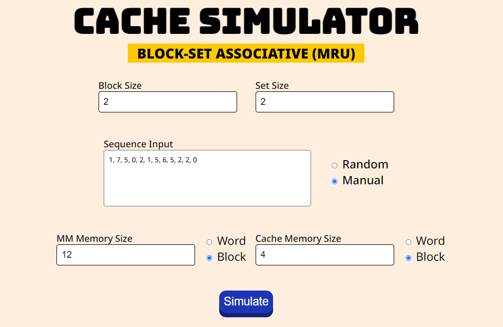
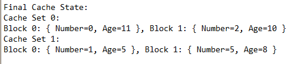
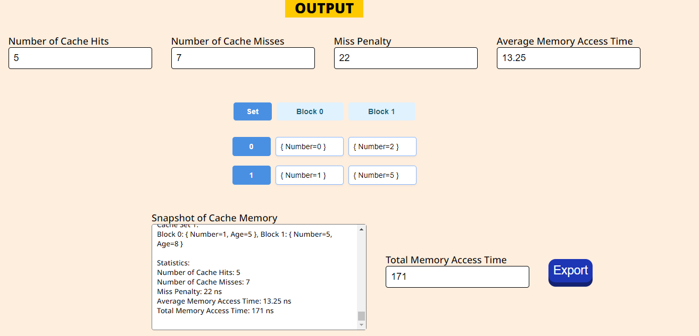
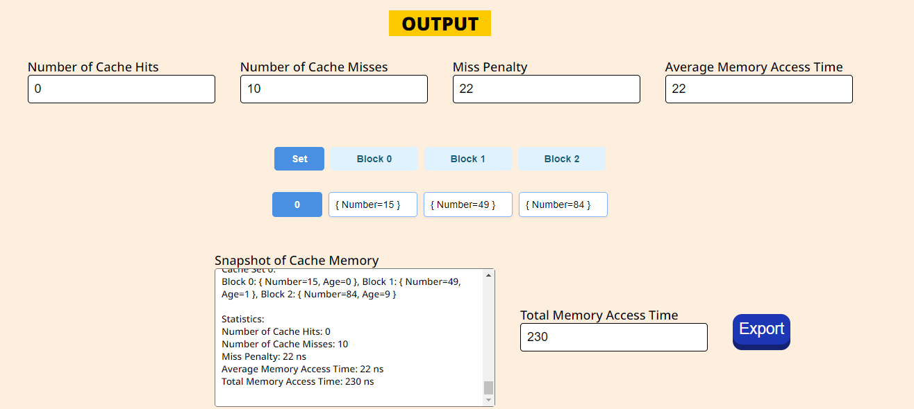

# Cache simulator (Block-set-associative / MRU
### Gomez, Dominic Joel ; Parker, Peter B. ; Togado, Dalrianne Francesca
### CSARCH2 - S13

### How to use the program
1. Open ```https://prkrptr.github.io/index.html``` 
2. Input block size, set size, mm memory size, cache memory size, input sequence can be random or manual
3. After clicking the simulate button, a visual output and the snapshot of cache memory will be displayed ready to be exported.


### Cache System Specifications

---
### Input:
- [x] Block size, 
- [x] set size, 
- [x] MM memory size (accept both blocks and words), 
- [x] Cache memory size (accept both blocks and words)
- [x] Program flow to be simulated (accept both blocks and words) and other parameters deemed needed.
  - Uses block sequence

### Output:
- [x] number of cache hits
- [x] number of cache miss
- [x] miss penalty
- [x] average memory
- [x] access time
- [x] total memory access time
- [x] snapshot of the cache memory.
- [x] With option to output result in text file.

--- 

### How the Program Works
1. Input the block size, set size, MM memory size, and cache memory size.
2. Choose test case sequence input: Random, Manual.
3. Click the simulate button.
4. The output will then be displayed.

---

### Detailed Test Case Analysis
---

Testcases that will cover the specifications (Normal, special case, different inputs)
1st Test case:
Cache has 4 blocks, set size is 2 blocks, block size is 2 words
Input: 1, 7, 5, 0, 2, 1, 5, 6, 5, 2, 2, 0
Output:
1. Cache Hits: 5/12 = 0.42
2. Cache Miss: 7/12 = 0.58
3. Miss Penalty: 1ns + 20ns + 1 ns = 22ns
4. Average Memory Access Time: 0.42 * 1ns + 0.58 * 22ns = 13.25ns
5. Total Memory Access Time: 5*2*1ns + 7*2*11ns + 7*1ns = 164ns + 7ns = 171ns
6. Snapshot of cache memory:

| SET | BLOCK (0) | BLOCK (1) |
|-----|-----------|-----------|
| 0   | 0         | 2         |
| Age | 11        | 10        |
| 1   | 1         | 5         |
| Age | 5         | 8         |



2nd Test Case:
Cache has 3 blocks, set size is 3 blocks, block size is 2 words
Input: 15, 49, 29, 30, 10, 85, 50, 31, 82, 84
Output:
1. Cache Hits: 0/10 
2. Cache Miss: 10/10
3. Miss Penalty: 1ns + 20ns + 1 ns = 22ns
4. Average Memory Access Time: 0* 1ns + 1 * 22ns = 22ns
5. Total Memory Access Time: 0*2*1ns + 10*2*11ns + 10*1ns = 230 + 10 = 230 ns
6. Snapshot of cache memory:

| SET | BLOCK (0) | BLOCK (1) | BLOCK (3) |
|-----|-----------|-----------|-----------|
| 0   | 15        | 49        | 84        |
| AGE | 0         | 1         | 9         |



